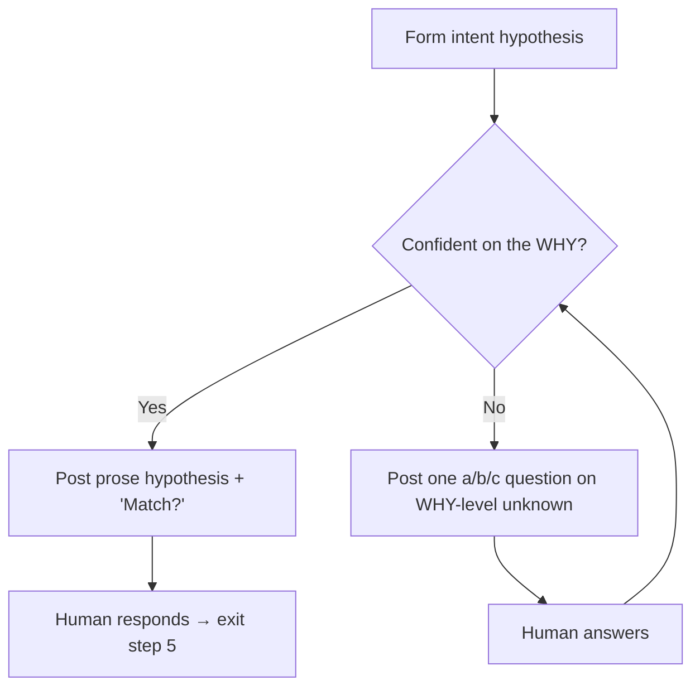

# Clarifying intent

You've formed an intent hypothesis from the survey + smart read. This step has two modes — confident and uncertain — and you pick one each turn.

## The two modes



Each turn, ask yourself: *can I write the WHY in 1–2 confident sentences right now?*

- **Yes** → confident mode (prose + "Match?"). On response, exit step 5.
- **No** → uncertain mode (one a/b/c question on the biggest WHY-level unknown). On response, re-evaluate.

Always exit through prose + "Match?". Even after a few a/b/c rounds, the wrap-up is "here's my read of the WHY, match?". That's the final confirmation gate.

No hard cap on a/b/c iterations, but the bar is high — every question must materially change the WHY. Most reviews exit in 0 a/b/c (confident from the start). The expected case for uncertain mode is 1–2 a/b/c.

## Confident mode

The WHY of the *change*, not the WHY of the review. In one or two sentences, cover:

- What problem is being solved or what capability is being added.
- Roughly how the change accomplishes it (high-level — not file-by-file).

### Format

```
**My read of this change:**

<one or two sentences — just the WHY and the rough mechanism.>

Match? Anything I got wrong?
```

That is the entire message. Nothing else.

## Uncertain mode

When the WHY itself has a binary or ternary unknown whose answer would change the review's focus — ask one a/b/c question.

### Format

```
**Q: <single question about the WHY>**

a) <plausible answer>
b) <plausible alternative>
c) Let me explain.
```

### Threshold for switching to uncertain mode

Ask a/b/c when the answer would change the WHY itself:

- "Is the goal correctness or speed?" — yes, ask.
- "Is this scoped to feature X, or all of Y?" — yes, ask.
- "Which file matters most?" — no, that's focal area, not WHY (banned).
- "Is `parseAuthHeader` line 42 intentional?" — no, that's review work (banned).

If you're not sure whether something is WHY-level: would your review's *focus* differ depending on the answer? If no, don't ask.

## Hard rules (apply to both modes)

- **One question per turn.** No stacked "also..." follow-ups.
- **a) and b) must both be plausible.** Not strawmen. The human should be able to pick without explanation in most cases.
- **c) is always "Let me explain".** Never replace with a third concrete option — the human always needs an escape hatch.
- **No focal-area questions.** "Which file matters most?", "should I dig into X?" — those are review work, not intent.
- **No review-work questions.** "Is this line a bug?", "is this pattern intentional?" — those go in the review.
- **No commit-message commentary.** "This commit says 'addresses review' — sounds like a previous review pass" is noise.
- **No padding.** No preamble ("Looking at the diff..."), no trailing "I'll then dispatch subagents to...".
- **Confident mode: 1–2 sentences.** If you can't fit it, you don't yet understand the change well enough — go read more diff before posting.

## Examples

### Good — confident mode, concise

> **My read of this change:** Adds gzip compression to HTTP responses and bundles `syntax.css` into the main hashed CSS file, both to cut cold-load latency.
>
> Match? Anything I got wrong?

### Good — confident mode, concise

> **My read of this change:** Replaces the bespoke session-token check in the auth middleware with the new central `verifyToken` helper, so we stop diverging from the rest of the codebase.
>
> Match?

### Good — uncertain mode, clean a/b/c on the WHY

> **Q: This reworks the export pipeline. What's the goal?**
>
> a) Correctness — the old path silently dropped rows.
> b) Speed — parallel writes are new.
> c) Let me explain.

### Bad — folding uncertainty into prose

> **My read of this change:** Reworks the export pipeline — but I can't tell whether the goal is correctness (the old path silently dropped rows) or speed (parallel writes are new). Which is it?

Use uncertain mode (a/b/c) instead. Stuffing the question into prose mixes hypothesis and clarification — the human now has to parse both at once.

### Bad — too long

> **My read of this change:** These two commits add gzip compression + bundle `syntax.css` into the main hashed CSS file to cut cold-load latency. The implementation has two non-obvious pieces:
>
> 1. A `defaultHTMLContentType` middleware that pre-sets `text/html` so chi's `Compress` middleware...
> 2. `cat syntax.css >> output.css` in both `Dockerfile` and `Taskfile`...
>
> The follow-up commit `ab77721` "addresses review" — sounds like a previous review pass already happened.

The implementation walkthrough is review work, not intent. Save it for the report. Commit-message commentary is noise.

### Bad — focal-area questions as fake a/b/c

> **My read of this change:** ... [intent paragraph] ...
>
> A few specific things I'd dig into unless you steer me elsewhere:
>
> - a) Do other non-HTML handlers properly override the pre-set `text/html`?
> - b) Is the gzip middleware actually triggering for the routes you expect?
> - c) The new test does `os.Chdir("../..")` — is that going to bite us?

All three are review work, not intent. Even though a/b/c is allowed in this step, it's only for WHY-level uncertainty. Focal-area picks are still banned. Also: a/b/c is "alternative answers to one question", not "three different questions".

## After the human responds

- **Confident mode + confirms:** one sentence — *"Got it — kicking off the deep review now."* — then move to step 6.
- **Confident mode + corrects:** internalize silently. Don't re-confirm. Trust them.
- **Uncertain mode + picks a or b:** internalize, then re-evaluate. If you can now write a confident WHY, switch to confident mode (prose + "Match?"). If still uncertain on a different axis, ask the next a/b/c.
- **Uncertain mode + picks c "Let me explain":** read their answer, internalize, re-evaluate the same way.
- **Says "just review it, you figure it out":** lock in your hypothesis as the working intent. Note in the final report that intent was unconfirmed.
- **Reviewing someone else's PR and don't know intent:** treat commit messages as the intent source. Post hypothesis (confident mode); note in the final report that intent came from commits, not the human.

## Where a/b/c questions appear in the skill

Two places, with different scopes:

- **Intent step (this file)** — only for WHY-level uncertainty. Banned for focal areas, review work, commit commentary.
- **Synthesizing findings (`synthesizing-findings.md`)** — for resolving genuinely ambiguous findings (bug vs intentional). Different shape — see that file.
