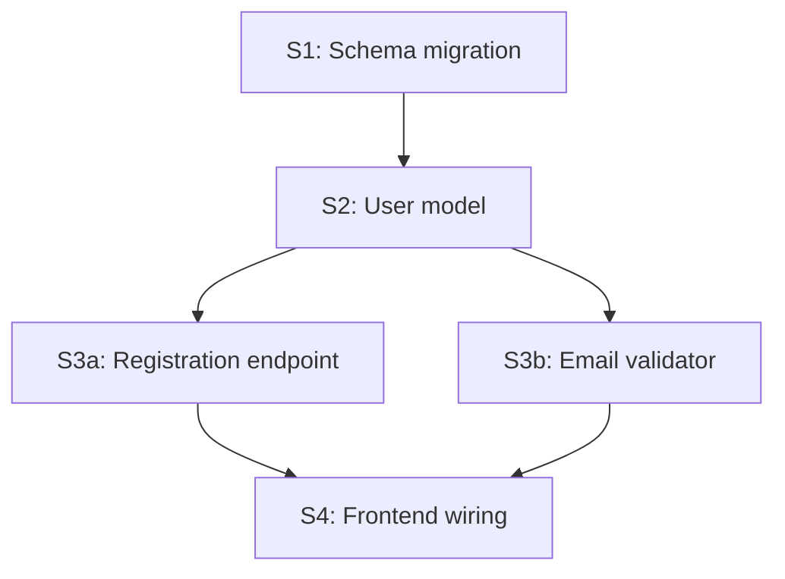

# Turn the approved spec into an executable plan

> Reference loaded by `devk-brainstorm` after `references/writing-spec.md` has produced an approved spec. Follow these instructions as if they replaced the main skill.

Spec is approved. Now produce a plan structured as a **directed graph of sections, grouped into waves** the executor can dispatch in parallel. This phase is about structure, dependencies, and execution waves — not re-designing the spec.

## Core principles

- **Quality over speed. No shortcuts.** A bad plan turns into wasted parallel work and merge conflicts.
- **Parallelism is the default, not the exception.** Two sections that touch disjoint files can run in parallel. Most pairs should. Sequence only when there's a real dependency.
- **Each section must be self-contained.** A fresh subagent with the section's text should be able to execute it. Context lives in the section, not "see section 3."
- **TDD per section.** Each section lists the tests to write first as **behaviors**, not assertions. If you can't describe the tests, the section is underspecified — clarify before moving on.
- **Right-sized, not strictly-sized.** A section is one focused chunk a single subagent can complete in one pass. Use judgment; no hard limits on file count or time.

## Inputs

- `.devk/spec.md` (approved)
- `.devk/requirements.md` (context)
- The project itself — scan it enough to figure out what files different sections will actually touch.

## Designing for parallelism

The biggest lever in this workflow is **how you cut the spec into sections**. Cut poorly → everything serializes. Cut well → most work runs in parallel and the wall clock shrinks.

**Prefer orthogonal sections over vertical slices** when the spec allows it.

- ✅ **Orthogonal:** `S3a` = "Registration endpoint + its tests"; `S3b` = "Email validator module + its tests" — different files, run in parallel after the shared model exists.
- ❌ **Vertical and overlapping:** `S3` = "User registration end-to-end: DB write + API handler + UI form + tests" — one fat section that doesn't parallelize with anything because it touches every layer.

Vertical slices are the right call when **incremental end-to-end delivery is the actual unit of work** — e.g., shipping one user flow at a time when partial flows are useless. Use vertical slices then, and accept the parallelism cost.

**Patterns that help parallelism:**
- Establish bedrock first (schema, shared types, interfaces) → downstream sections build on it in parallel.
- Use feature flags or branch-by-abstraction to land related code in parallel without breaking integration.
- Split by file/module boundary: one section per module when modules don't depend on each other.

**Patterns that hurt parallelism:**
- "All DB changes in one section" — creates a giant section every downstream wave waits on.
- Touching shared config, types, or schemas across multiple sections in the same wave.
- Designing sections by *layer* (DB layer, API layer, UI layer) instead of by *feature concern*.

## Plan structure

Write to `.devk/plan.md`:

````markdown
# Plan: <feature name>

## Overview
<3-5 sentences: the shape of the work, why this wave order.>

## Dependency graph



## Execution waves

- **Wave 1:** S1 — Schema migration
- **Wave 2:** S2 — User model
- **Wave 3:** S3a, S3b — registration endpoint + email validator (parallel)
- **Wave 4:** S4 — frontend wiring

Sections in the same wave are parallel-safe by construction (file-disjoint). The executor dispatches the entire wave at once.

## Sections

### S1: Schema migration

**Goal:** <one sentence>

**Wave:** 1
**Depends on:** none

**Files touched (anticipated):** <list or glob — within a wave these lists must not overlap>

**Tests to write first (TDD):**
- <behavior> — expects: <observable>
- <behavior> — expects: <observable>

**Implementation outline:**
- <bullet — what the impl needs to do>
- <bullet>

**Acceptance criteria:**
- <observable thing the reviewer will check>

**Notes for the section agent:**
<anything non-obvious — e.g., "use the existing `Foo` helper, don't re-invent", "this file has a linter rule about Y">

---

### S2: ...

<same structure>

---

## Material decisions (carried from spec)
<Repeat the "Decisions and rationale" from the spec. One line each. The execution agents see this without re-reading the spec.>

## Risks / open questions
<Anything from the spec that might bite during execution. Mitigations where you have them.>
````

## Wave rubric — file disjointness primary

Two sections belong to the same wave (run in parallel) **if and only if** all three are true:

1. **They touch disjoint files.** Their "Files touched" lists do not overlap. **This is the primary check** — it's mechanical and verifiable.
2. **Neither depends on the other's output.** No "S3 imports a thing S2 just exported."
3. **Their tests don't share mutable state without isolation.** E.g., both writing to the same DB table in integration tests without per-test cleanup.

If any check fails → different waves.

If you're not sure whether files overlap, glob both lists and check. False parallelism creates merge conflicts and silent bugs; the cost of one extra wave is small. **When uncertain, sequence.** But uncertainty should be rare — file paths are knowable.

## TDD-first discipline

For each section, write the tests-first list as **behaviors**, not assertions. "`register()` creates a user with the right shape" is one behavior (one test, several assertions on the returned user is fine). "`register()` rejects duplicate emails" is a different behavior (separate test).

If a section can't be unit-tested cleanly (e.g., "add a button to a page"), say so and specify the observable check (snapshot, manual flow, integration test).

**Keep the list lean.** Tests cover behaviors, not fields. Five entries with nearly identical setup differing in which field they assert on should be one parameterized test. The section agent expands on the plan but takes its tone from it — sprawly plans produce sprawly test files.

## Sizing — qualitative, not strict

A good section:
- **Is self-contained.** One fresh subagent can complete it without loading the whole project.
- **Has clear acceptance criteria.** The reviewer subagent can check "done" against the plan entry alone.
- **Touches a coherent set of files** mapping to one concept (a model, an endpoint, a validator, a migration).

No hard limits on file count or time — let the work shape the section. If a section feels like it's straddling two concerns, split it. If two adjacent sections feel like they're really one, merge them.

## When the spec can't be planned

If you find mid-plan that the spec has gaps — two sections contradict, a required data shape is missing, two sections can't be made file-disjoint without spec changes — **STOP**. Go back to the user:

> "While planning, I found <specific gap or conflict>. I can't plan around it without making decisions the spec didn't cover. Options:
> a) I make this call myself and document it — [my proposal]
> b) You want to decide this one — [option 1] / [option 2]
> c) Pause and loop back to the spec to tighten this"

Small gaps you can fill with a one-line announced decision in the plan; big gaps need the human.

## Approval gate (third and final gate before execution)

Present the plan in PM-friendly terms. The full plan lives at `.devk/plan.md`; your presentation is a summary.

> ## Plan ready for your sign-off
>
> Here's how I'll build this, broken into waves I can dispatch in parallel.
>
> **The waves:**
> 1. <Plain-language description of wave 1>
> 2. <Wave 2 — for parallel waves: "Two pieces in parallel: X and Y">
> 3. <Wave 3>
>
> **Order rationale:** <1-2 sentences. E.g., "Schema first because everything else builds on it; then the orthogonal feature pieces in parallel; then wiring.">
>
> **Parallelism payoff:** <e.g., "Waves 3 and 5 run two pieces in parallel — should noticeably cut wall time vs. sequential.">
>
> **Anything new I decided during planning:** <material decisions not already in the spec — omit if none.>
>
> Sound right? Approve and I'll start building — I'll report per wave as it lands. Or flag what to change.

**Wait for explicit approval.** On approval:

1. **Commit the plan** (if git repo). Stage only `.devk/plan.md`. Match the project's commit convention if obvious; default `devk: plan for <feature title>`.
   ```
   git add .devk/plan.md
   git commit -m "devk: plan for <feature title>"
   ```
   Skip silently if not a git repo.

2. Load `references/executing-plan.md` from this skill and follow it.

## If the user wants to stop here

If the user wants to pause or drop this after seeing the plan ("let's not do this", "shelving it", "changed my mind"), acknowledge and offer to tidy up `.devk/`.

> Got it — pausing this.
>
> Working notes in `.devk/`:
> - `requirements.md` — what we agreed to build
> - `spec.md` — the design
> - `plan.md` — the breakdown
>
> What should I do with them?
>
> **a) Leave as-is** — I'll pick up next time. *Default if you might come back to this.*
> **b) Archive** — move to `.devk/archive/<YYYY-MM-DD>-<slug>/`.
> **c) Delete** — clean slate. I'll confirm first.

Act on the answer:
- **a)** Do nothing.
- **b)** `mkdir -p .devk/archive/<date>-<slug>/`, `git mv` (or `mv`) existing `.devk/*.md` into it. Commit if git repo: `devk: archive in-flight work (<slug>)`.
- **c)** Show the list, confirm, then `rm`. Commit: `devk: discard in-flight work (<slug>)`.

## Reminders

- Parallelism is the default. Sequence only when there's a real dependency.
- Orthogonal sections > vertical slices when the spec allows it.
- Mermaid graph + wave list in `plan.md` — both serve different readers.
- File disjointness is the wave rubric. Check it mechanically.
- TDD per section, tests as behaviors not assertions.
- Approval gate is the LAST stop before execution. Make it easy to approve or redirect.
- Artifact (`plan.md`) is technical. The human-facing presentation is PM-friendly.
